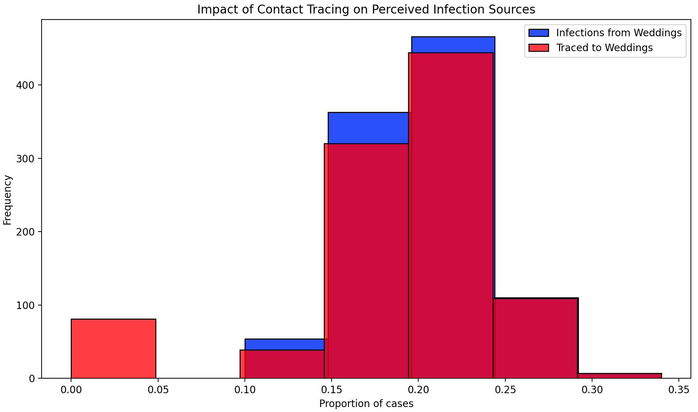

# ASSIGNMENT: Sampling and Reproducibility in Python

Read the blog post [Contact tracing can give a biased sample of COVID-19 cases](https://andrewwhitby.com/2020/11/24/contact-tracing-biased/) by Andrew Whitby to understand the context and motivation behind the simulation model we will be examining.

Examine the code in `whitby_covid_tracing.py`. Identify all stages at which sampling is occurring in the model. Describe in words the sampling procedure, referencing the functions used, sample size, sampling frame, any underlying distributions involved, and how these relate to the procedure outlined in the blog post.

Run the Python script file called whitby_covid_tracing.py as is and compare the results to the graphs in the original blog post. Does this code appear to reproduce the graphs from the original blog post?

Modify the number of repetitions in the simulation to 100 (from the original 1000). Run the script multiple times and observe the outputted graphs. Comment on the reproducibility of the results.

Alter the code so that it is reproducible. Describe the changes you made to the code and how they affected the reproducibility of the script file. The output does not need to match Whitby’s original blogpost/graphs, it just needs to produce the same output when run multiple times

# Author: Mina Mahdian 

```
Please write your explanation here...The code simulates a scenario involving the spread of infection at two types of events—weddings and brunches. It uses contact tracing to track infected individuals and evaluates how the tracing process attributes cases to specific events.
Stage 1: Infection Sampling
Procedure:
•	A random subset of individuals in the population (ppl) is sampled to be infected based on the ATTACK_RATE constant (e.g., 10% of the total population).
•	The function np.random.choice is used to select these individuals.
Sample Size:
•	The number of infected individuals is calculated as int(len(ppl) * ATTACK_RATE), which depends on the total population size (1,000 individuals in this case).
Sampling Frame:
•	The sampling frame is the complete population of attendees from both events (weddings and brunches combined).
Underlying Distribution:
•	This sampling assumes a uniform random distribution.
Stage 2: Primary Contact Tracing Sampling
•	Procedure:
•	A subset of infected individuals is sampled to determine if they are traced, based on the TRACE_SUCCESS constant (e.g., 20% chance).
•	The function np.random.rand is used here to generate random numbers for each infected individual.
Sample Size:
•	The sample size is sum(ppl['infected']), which depends on the number of individuals infected in Stage 1.
•  Sampling Frame:
The sampling frame is the subset of infected individuals.
 Underlying Distribution:
•	A uniform random distribution is used to decide tracing success.
Stage 3: Secondary Contact Tracing Sampling
•	Procedure:
Counts how many traced cases are associated with each event type and selects events with a minimum threshold (SECONDARY_TRACE_THRESHOLD).
o	A subset of individuals who attended the traced events is then marked as traced.
•	Sample Size:
o	Depends on the number of events meeting the threshold and the number of individuals infected and traced from those events.
•  Sampling Frame:
•	Individuals attending events that meet the tracing threshold.
•  Underlying Distribution:
•	Sampling is conditional on the event participation data and traced counts.

Connect Sampling to Code Functions
1- Infection Sampling: np.random.choice used to pick infected individuals.

2- Primary Tracing Sampling:np.random.rand used to decide success of tracing.

3- Secondary Tracing Sampling:Event counts are calculated using ppl[ppl['traced'] == True]['event'].value_counts().
Infection sampling reflects real-world random exposure to an infection source.

Primary and secondary tracing stages simulate realistic methods used in contact tracing scenarios, such as identifying infected individuals and linking them back to potential sources.

Question 2: The code could not reproduce the exact same plot, but it generated a closely similar result.



Question 3: When I decreased the number of repetitions in the simulation to 100, the generated plot was not reproducible.
Question 4: I increased the simulation time to 10,000, which resulted in more reproducible data.


## Criteria

|Criteria|Complete|Incomplete|
|--------|----|----|
|Altercation of the code|The code changes made, made it reproducible.|The code is still not reproducible.|
|Description of changes|The author explained the reasonings for the changes made well.|The author did not explain the reasonings for the changes made well.|

## Submission Information

🚨 **Please review our [Assignment Submission Guide](https://github.com/UofT-DSI/onboarding/blob/main/onboarding_documents/submissions.md)** 🚨 for detailed instructions on how to format, branch, and submit your work. Following these guidelines is crucial for your submissions to be evaluated correctly.

### Submission Parameters:
* Submission Due Date: `23:59 - 09/04/2025`
* The branch name for your repo should be: `assignment-1`
* What to submit for this assignment:
    * This markdown file (a1_sampling_and_reproducibility.md) should be populated.
    * The `whitby_covid_tracing.py` should be changed.
* What the pull request link should look like for this assignment: `https://github.com/<your_github_username>/sampling/pull/<pr_id>`
    * Open a private window in your browser. Copy and paste the link to your pull request into the address bar. Make sure you can see your pull request properly. This helps the technical facilitator and learning support staff review your submission easily.

Checklist:
- [ ] Create a branch called `assignment-1`.
- [ ] Ensure that the repository is public.
- [ ] Review [the PR description guidelines](https://github.com/UofT-DSI/onboarding/blob/main/onboarding_documents/submissions.md#guidelines-for-pull-request-descriptions) and adhere to them.
- [ ] Verify that the link is accessible in a private browser window.

If you encounter any difficulties or have questions, please don't hesitate to reach out to our team via the help channel in Slack. Our Technical Facilitators and Learning Support staff are here to help you navigate any challenges.
